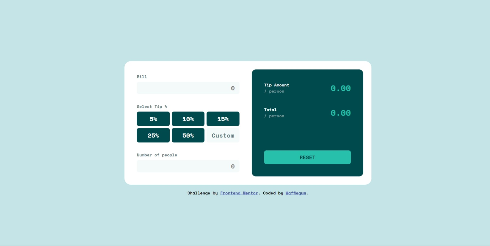

# Frontend Mentor - Tip calculator app solution

This is a solution to the [Tip calculator app challenge on Frontend Mentor](https://www.frontendmentor.io/challenges/tip-calculator-app-ugJNGbJUX).

## Table of contents

- [Overview](#overview)
  - [The challenge](#the-challenge)
  - [Screenshot](#screenshot)
  - [Links](#links)
- [Author](#author)

**Note: Delete this note and update the table of contents based on what sections you keep.**

## Overview

### The challenge

Users should be able to:

- View the optimal layout for the app depending on their device's screen size
- See hover states for all interactive elements on the page
- Calculate the correct tip and total cost of the bill per person

### Screenshot

### Links

- Solution URL: [Add solution URL here](https://www.frontendmentor.io/solutions/tip-calculator-rys6e7czUq)
- Live Site URL: [Add live site URL here](https://wafflegum.github.io/tip-calculator/)

## Author
- Frontend Mentor - [@Wafflegum](https://www.frontendmentor.io/profile/Wafflegum)
- Twitter - [@wafflegum_](https://www.twitter.com/wafflegum_)